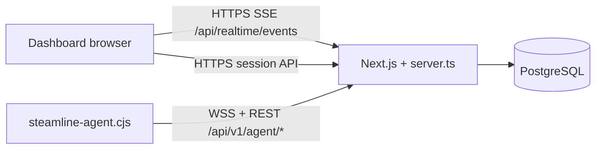

# Current architecture (audit snapshot)

Brief map of **Steamline** / **GameServerOS** control plane and agents. For dependency lists see [DEPENDENCY-MANIFEST.md](./DEPENDENCY-MANIFEST.md).

## Topology

- **Users** use the hosted Next.js app (register, hosts, catalog, instances, billing).
- **Agents** on customer machines use a **long-lived API key** after enrollment; all agent calls are **HTTPS** to the same origin, plus **WebSocket** (`wss`/`ws`) on `/api/v1/agent/ws` when enabled.

## Agent

- **Language:** TypeScript → bundled with **esbuild** to `public/steamline-agent.cjs` (Node **18+**).
- **Transport:** **WebSocket** primary (`agent/agent-ws.ts`), **REST** fallback (`POST /api/v1/agent/heartbeat`) if WS unavailable or stale.
- **Auth:** `Authorization: Bearer <STEAMLINE_API_KEY>` after enroll; key stored in `~/.steamline/steamline-agent.env` (or env vars).
- **Enrollment:** `POST /api/v1/agent/enroll` with **enrollment token** or **pairing code**; `install-agent.sh` downloads the bundle and runs enroll.
- **Game servers:** Agent polls **`GET /api/v1/agent/instances`**, provisions via SteamCMD (`agent/provision.ts`), reports status/logs to REST endpoints. **Power/watchdog/cleanup** use the same instance list.
- **Firewall:** Linux `firewalld` / `firewall-cmd` when available (`agent/linux-firewall.ts`); Windows netsh path for dev.
- **Telemetry:** `agent/collect-metrics.ts` + `agent/environment-detect.ts`; payload accepted by heartbeat handler (`src/lib/agent/heartbeat-core.ts`), stored in **`hosts.host_metrics`** JSON.

### Agent REST/WebSocket endpoints used

`POST /api/v1/agent/enroll`, `POST /api/v1/agent/heartbeat`, `GET /api/v1/agent/instances`, `POST /api/v1/agent/instances/:id/ack`, `POST /api/v1/agent/instances/:id/status`, `POST /api/v1/agent/instances/:id/logs`, `GET /api/v1/agent/host`, `POST /api/v1/agent/host/removal-complete`, `POST /api/v1/agent/instances/:id/purge-complete`, `POST /api/v1/agent/reboot-ack`, **`POST /api/v1/agent/backup-schedule`**, **`GET /api/v1/agent/updates/latest`**, **`GET /api/v1/agent/artifact`**, **`/api/v1/agent/ws`** (WebSocket).

### Agent self-update (Phase 6)

- **Manifest:** `GET /api/v1/agent/updates/latest` (Bearer) returns semver, `downloadUrl`, `checksumSha256`, optional `releaseNotes` / `minAgentVersion`. Version and hash come from `public/steamline-agent.cjs` and root `package.json` at runtime.
- **Artifact:** `GET /api/v1/agent/artifact?version=<semver>` (Bearer) streams the same bundle; version must match the published build.
- **Agent:** Linux installs under `~/.steamline/steamline-agent.cjs` download → SHA-256 verify → backup `.bak` → replace → detached `node … run <baseUrl>`. Env: `STEAMLINE_AGENT_AUTO_UPDATE=1` (optional auto-apply after periodic check), `STEAMLINE_AGENT_UPDATE_INTERVAL_MS` (default 6h), `AGENT_RELEASE_NOTES`, `AGENT_MIN_AGENT_VERSION` on the server.
- **Dashboard:** Host detail **Agent updates** card; WebSocket commands `apply_agent_update` / `check_agent_update`. Agents emit `agent_update_event` on the same socket; events are stored in **`host_agent_update_events`** (recent history in the UI). **`GET /api/cron/prune-agent-update-events`** (Bearer `CRON_SECRET`) deletes rows older than **`AGENT_UPDATE_EVENT_RETENTION_DAYS`** (default 30).

## Platform

- **Framework:** Next.js App Router, API routes under `src/app/api/**`.
- **DB:** **Drizzle ORM** + PostgreSQL; hosts, instances, catalog, sessions, subscriptions, etc. (`src/db/schema.ts`).
- **Host updates to UI:** **`publishHostRealtime`** → **SSE** `GET /api/realtime/events` (`src/lib/realtime/host-updates.ts`); dashboard components subscribe (`realtime-dashboard-refresh.tsx`, refresh on host events + **refresh when returning** to a tab hidden ≥3s). Payload kinds include heartbeats/metrics and **`agent_update`** (self-update progress over the agent WebSocket). **`notifyHostOwnerDashboard`** / **`notifyUserServersRealtime`** (`src/lib/realtime/notify-dashboard.ts`) fire the same channel after API mutations (power state, provisioning status, host settings) and agent callbacks (**reboot-ack**, **purge-complete**, **removal-complete**, install-time **linux-root-password**) so UIs refresh without waiting for the next heartbeat. Client components share **`useHostRealtimeEvents`** and **`useHostRealtimeForHost`** (`src/lib/realtime/use-host-realtime-events.ts`) for SSE subscription + reconnect backoff (used by Realtime dashboard refresh, Add host wizard, Host Agent updates, Host removal status, and Instance deploy progress) with slower fallback polling.
- **Presence:** `HOST_HEARTBEAT_MAX_AGE_MS` (**6s**) + `lastSeenAt` for effective online/offline (`src/lib/host-presence.ts`).

## Remote terminal (Phase 5)

- Browser WebSocket: `/api/hosts/ws-terminal?hostId=` (session cookie auth).
- Relay + audit: `src/server/browser-terminal-ws-upgrade.ts`, `src/lib/terminal/*`, table `host_terminal_sessions`.
- Agent: `agent/terminal-manager.ts` uses native **`node-pty`** (optional dependency / `~/.steamline/node_modules`, installed by `install-agent.sh`). Bundled agent **externalizes** `node-pty` in `scripts/bundle-agent.mjs`.
- Linux + root agent only; max 5 concurrent sessions per host; 30 min idle timeout (`STEAMLINE_TERMINAL_IDLE_MS`).

## Backups (Phase 8)

- **Data:** `host_backup_destinations`, `host_backup_policies` (optional `instance_id`, UTC schedule, retention), `host_backup_runs`.
- **UI:** Host detail **Backups** card — configure destinations (local / S3-compatible / SFTP), retention, schedules; manual backup/restore; history with download links. Supports destination edit/delete and policy enable/disable/delete controls. **S3** downloads use presigned URLs; local/SFTP responses describe paths on the host.
- **Agent:** `agent/backup.ts` (tar.gz, optional RCON save via `STEAMLINE_RCON_PASSWORD`); polls **`POST /api/v1/agent/backup-schedule`** for due scheduled jobs. WebSocket control: `backup_run`, `backup_restore`, `backup_test`, `backup_delete` for **local and SFTP** artifact removal.
- **Control plane:** `src/lib/backup-schedule.ts` decides when to enqueue runs; **`DELETE`** on a completed run deletes **S3** objects with the destination credentials on the server (no agent required). Local/SFTP deletes still need a connected agent to remove files on the machine.
- **Retention:** **`GET /api/cron/prune-backup-runs`** (Bearer `CRON_SECRET`) deletes **`host_backup_runs`** rows older than **`BACKUP_RUN_RETENTION_DAYS`** (default **365**; invalid values fall back to default). This only trims dashboard history; it does not delete remote files.

## Notifications (product)

- **Tables:** `user_notifications`, `user_notification_settings`, `user_notification_event_prefs` (`drizzle/0017_notifications.sql`).
- **API:** `/api/notifications`, `/api/notifications/[id]`, `/api/notification-settings`, test webhook route.
- **Server helpers:** `src/lib/user-notifications.ts` — `recordUserNotification`, dedupe/cooldown, email/webhook delivery, `notifyGameServerFailed` / `notifyGameServerCrash`, backup terminal hooks, agent update mapping, host/disk/OS events from heartbeat + cron.
- **Cron:** `GET /api/cron/host-offline-notifications` (stale heartbeat → `host_offline`).

## GameServerOS (image + installer)

- **Design:** `gameserveros/docs/BASE-OS.md`, `PARTITIONING.md`, `BOOT-SOFTWARE.md`, `AUTONOMY.md`.
- **First-boot TUI:** `gameserveros/installer/install-main.sh` (dialog; logs to `/var/log/gameserveros-install.log`).
- **Reverse pairing:** `POST /api/public/gameserveros/install-session`, poll `GET /api/public/gameserveros/install-session/status`, dashboard `POST /api/hosts/gameserveros-claim` + UI `LinkGameServerOsSheet`.
- **Systemd:** `gameserveros/systemd/steamline-agent.service`, `gameserveros-first-boot.service`, `gameserveros-updater.{service,timer}`, `gameserveros-audit-forward.{service,timer}`.
- **Rootfs build:** `gameserveros/build/build-iso.sh` → `dist/gameserveros-*-amd64-rootfs.tar.gz`; CI `.github/workflows/build-iso.yml`.
- **Hardening on image:** `gameserveros/scripts/apply-os-hardening.sh` stages `config/sysctl`, `config/apparmor`, nftables template under `/opt/gameserveros/vendor`.

## Remaining / future

- **Hybrid bootable `.iso`** packaging (xorriso / live-boot) on top of the published rootfs tarball.
- **WebSocket instance list push** (optional): heartbeats already use WS; instance polling remains **REST** on a timer in `agent/cli.ts`.
