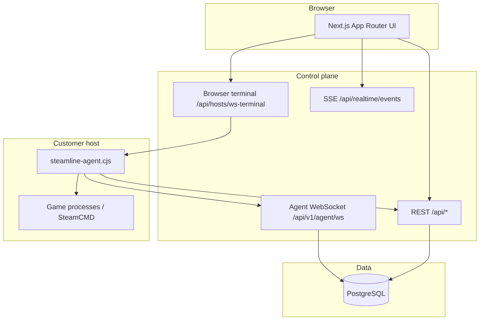

# Technical reference — Steamline / GameServerOS

For operators, support, and engineering. End-user guides: [getting-started](./getting-started.md), [management](./management.md), [troubleshooting](./troubleshooting.md).

## Architecture

## GameServerOS image

| Topic | Location / notes |
|-------|------------------|
| Base OS | Debian 12 **bookworm** amd64, **glibc**, see `gameserveros/docs/BASE-OS.md` |
| Partition plan | `gameserveros/docs/PARTITIONING.md` |
| Boot | UEFI + BIOS hybrid target; rootfs build in `gameserveros/build/build-iso.sh` |
| First-boot TUI | `gameserveros/installer/install-main.sh` (dialog) |
| Systemd | `gameserveros/systemd/*.service` + timers |
| Hardening apply | `gameserveros/scripts/apply-os-hardening.sh` (staged vendor tree) |
| OS updates | `gameserveros/scripts/gameserveros-updater.sh` + `gameserveros-updater.timer` |
| Audit digest | `gameserveros/scripts/audit-forward.sh` + timer |
| Cloud-init (optional) | `gameserveros/cloud-init/` |

### Reverse pairing (machine shows code)

| Method | Path |
|--------|------|
| POST | `/api/public/gameserveros/install-session` → `{ pairingCode, pollToken, expiresAt }` |
| GET | `/api/public/gameserveros/install-session/status` with `Authorization: Bearer <pollToken>` → `{ status }` |
| POST (session) | `/api/hosts/gameserveros-claim` (cookie auth) `{ pairingCode, name }` |

DB: `gameserveros_install_sessions` (`drizzle/0018_gameserveros_install_sessions.sql`).

## Agent

| Item | Path |
|------|------|
| Entry (dev) | `agent/cli.ts` → `run` |
| Bundle output | `public/steamline-agent.cjs` (`scripts/bundle-agent.mjs`) |
| WebSocket client | `agent/agent-ws.ts` |
| Provisioning | `agent/provision.ts` |
| Watchdog | `agent/watchdog.ts` (`MAX_FAILURES` default 5) |
| Environment | `agent/environment-detect.ts` → heartbeat `metrics.environment` |

### Agent REST (representative)

- `POST /api/v1/agent/enroll`
- `POST /api/v1/agent/heartbeat`
- `GET /api/v1/agent/instances`
- `POST /api/v1/agent/instances/:id/status`
- `POST /api/v1/agent/instances/:id/logs`
- `GET /api/v1/agent/host` — includes `updateMode`, `platformOs`
- `GET /api/v1/agent/updates/latest`, `GET /api/v1/agent/artifact`
- `POST /api/v1/agent/backup-schedule`
- WebSocket `/api/v1/agent/ws` — message types include `heartbeat`, `instance_status`, `instance_logs`, `agent_update_event`, backup events (`attach-agent-ws.ts`).

### Self-update

- Agent: `agent/self-update.ts` (`applyAgentSelfUpdate`, `maybeCheckForUpdate`, `runPostUpdateHealthCheck`, `rollbackAgentBinary`).
- Server persists `agent_update_event` via `insertHostAgentUpdateEvent` + user notifications (`notifyFromAgentUpdateEvent`).

## Security (control plane + image)

| Area | Repo path |
|------|-----------|
| Sysctl templates | `config/sysctl/99-gameserveros-hardening.conf` |
| AppArmor | `config/apparmor/steamline-agent`, `config/apparmor/steamline-gameserver` |
| nftables template | `gameserveros/nftables/99-gameserveros-nftables.nft` |
| Agent Linux firewall | `agent/linux-firewall.ts` (firewalld when present) |

**SSH:** not installed on GameServerOS image; `sshd` masked by hardening script.

## Network ports

| Direction | Ports |
|-----------|-------|
| Outbound | HTTPS **443** to dashboard; Steam CDN; optional package mirrors |
| Inbound | Game ports opened by agent when instances run; **not** 22 for SSH |

## ISO / rootfs CI

- Script: `gameserveros/build/build-iso.sh` (requires `sudo debootstrap`).
- Workflow: `.github/workflows/build-iso.yml` (`workflow_dispatch`).
- Artifact: `dist/gameserveros-<version>-amd64-rootfs.tar.gz` (+ `.sha256`).
- **Hybrid `.iso`:** extend with Debian Live / xorriso pipeline (see `gameserveros/build/README.md`).

## Database (Drizzle)

- Schema: `src/db/schema.ts`
- Migrations: `drizzle/*.sql` + `drizzle/meta/_journal.json`
- Notable tables: `hosts`, `server_instances`, `host_backup_*`, `user_notifications*`, `host_agent_update_events`, `gameserveros_install_sessions`

## Backups

- Destinations / policies / runs — see `src/lib/backup-schedule.ts`, `agent/backup.ts`.
- Archive: `tar.gz` on host or remote per destination type.

## Cron routes (Bearer `CRON_SECRET`)

- `GET /api/cron/prune-pairing`, `prune-logs`, `prune-backup-runs`, `prune-agent-update-events`, `host-offline-notifications`, **`gameserveros-prune-install-sessions`**

## Logs (support)

| Location | Content |
|----------|---------|
| Control plane | Application logs from hosting provider / `server.ts` |
| Agent host | `journalctl -u steamline-agent`, `/var/log/gameserveros-install.log` |
| GameServerOS updates | `journalctl -u gameserveros-updater.service` |

## Documentation site routes

- `/docs/getting-started`, `/docs/management`, `/docs/troubleshooting`, `/docs/technical-reference` — server-rendered from `/docs/*.md` via `marked` (`src/app/(main)/docs/[[...slug]]/page.tsx`).
